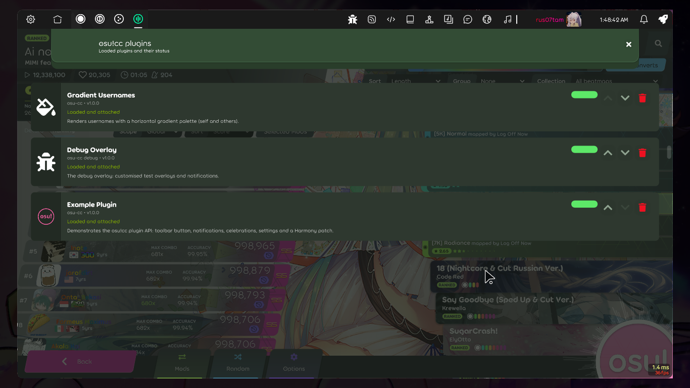
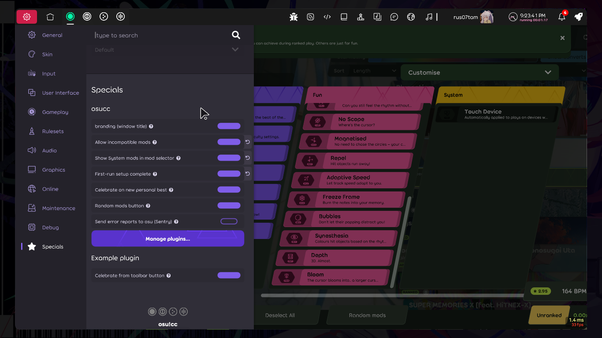
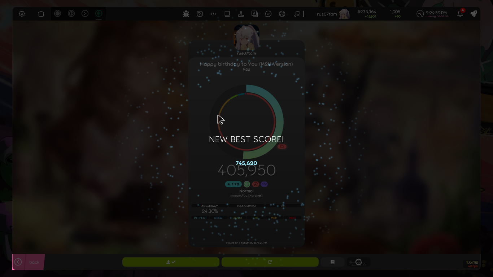
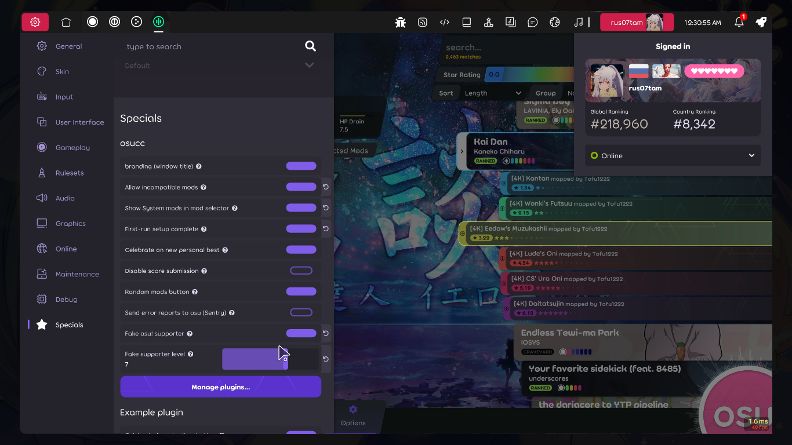
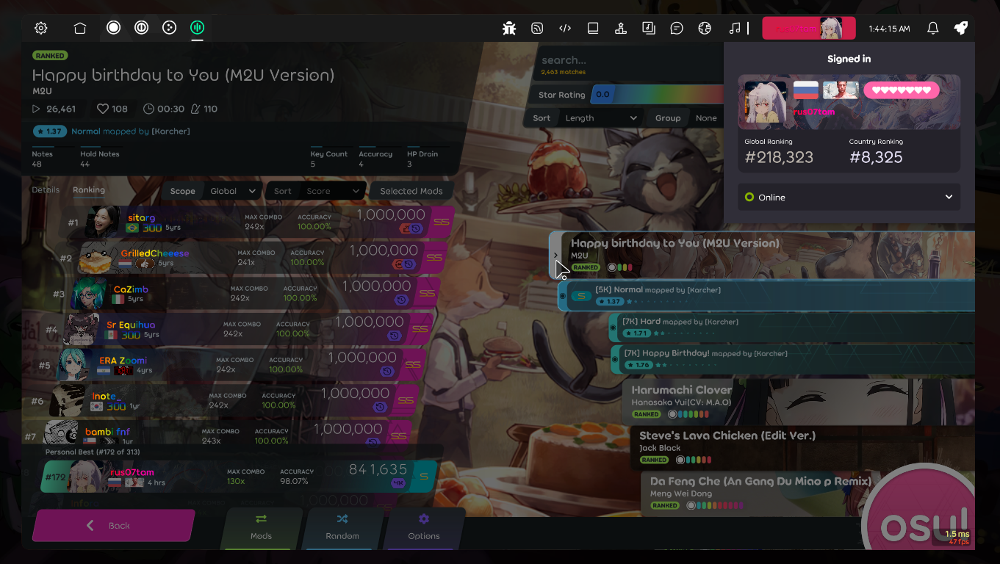

# osu!cc

**Docs:** [English](docs/en/DEVELOPMENT.md) · [Русский](docs/ru/README.md) · [Security](docs/en/SECURITY.md) · [Contributing](CONTRIBUTING.md) · [Code of Conduct](CODE_OF_CONDUCT.md)

osu!cc is an add-on for osu!lazer. It is not an official client. Think of it as
a set of optional improvements on top of the game you already have.

It never touches the osu! installation itself: nothing is copied into or changed
in the game folder, and the auth x-token signing works exactly like on a stock
client. The only thing it leaves behind is its own `osu-cc` folder in the game's
data directory, where it keeps settings, plugins and logs. Removing the client is
just deleting that folder.

> **Warning.** osu!cc is not an official osu! client. Using it breaks the osu!
> Terms of Service, and your account is your responsibility. We are not liable
> for anything that happens to it. And to be clear from the start: this project
> will never contain cheats or anything of that kind. Read
> [SECURITY.md](docs/en/SECURITY.md) before using it.

## Screenshots











## What it does

Most features are toggles in a dedicated **Specials** section in the game settings.

### Core features

- **Plugin manager**: plugins can add toolbar buttons, settings sections,
  overlays and their own notifications. Plugins support lifecycle hooks (they run
  when a plugin is installed, updated or uninstalled) and versioned data
  migrations, so they stay in sync across updates. Toggle them from the plugins
  overlay.
- **Allow incompatible mods**: pick and play mods that normally clash with
  each other.
- **Random mods button**: a button in the mod select footer that picks a
  random set of valid mods.
- **System mods column**: the usually-hidden `System` mod column (score v2,
  touch device, ...) shows up in the mod selector.
- **New record celebration**: a full-screen particle show when you set a new
  personal best.
- **Disable score submission**: block solo scores from being submitted to the
  osu! servers; local scores are still saved, and a reminder shows when a play
  starts.
- **Fake osu! supporter**: a local-only supporter tag with a custom level
  (1 to 10 hearts) on the current player, everywhere the profile appears. Nothing
  is sent to the servers.
- **Favourite map highlight**: favourited beatmaps get a pink pulsing outline
  in the song select carousel.
- **Download all favourites**: a button in a user profile's Beatmaps →
  Favourites section that downloads every favourited beatmap.
- **Branding**: the window title becomes "osu!cc".
- **Startup toast + first-run disclaimer**: a notification that the client
  loaded, and a one-time warning dialog.

### Bundled plugins

These ship with the client and can be disabled from the plugins overlay:

- **Username visuals**: paints every username with a horizontal gradient
  palette (your own name and everyone else's get separate palettes). It covers
  scoreboards, chat, profiles, multiplayer and toolbars. Your own username can
  also be replaced with a custom text or hidden behind a white block.
- **Subdivide Nations**: shows each user's sub-national region on profiles and
  user cards.
- **oii**: shows the improvement indicator next to the total play time on user
  profiles.
- **Friends leaderboard**: shows the friend leaderboard without an osu!supporter
  tag, built client-side from each friend's best score on the beatmap.
- **Debug overlay**: test panels for the notification and celebration systems.
- **ExamplePlugin**: a reference implementation that demonstrates the plugin
  API. It is meant for developers; delete it if you do not need it.

Planned:

- webview browser
- plugin browser & updater: find plugins and their metadata on GitHub, install
  and update them from the plugins overlay.
- more username-colour conditionals: per-player manual overrides, osu!supporter,
  has badge X, is a friend
- username font (also conditional, like the colours)
- game-wide font replacement
- local override for banners and badges
- custom banners and badges

## How it works

osu!lazer is a .NET app, so osu!cc loads through a .NET startup hook: the game
runs our code before it even reaches `Main()`. That is earlier than the usual
ruleset-injection trick and lets us change things other approaches cannot. The
proprietary `osu.Game.dll`, `osu.Game.Auth.dll` and `AuthNative.dll` are never
modified.

The hook only activates when osu! is launched through `osucc`. Starting it any
other way runs a vanilla osu!.

## Installation

### From source (recommended)

You need the .NET SDK 8.0 (download it from the
[official website](https://dotnet.microsoft.com/en-us/download/dotnet/8.0)) and
osu!lazer installed.

#### Windows

The launcher finds osu! automatically in `%LOCALAPPDATA%\osulazer\current`.

```shell
git clone https://github.com/rus07tam/osu-cc.git
dotnet build osucc.App\osucc.App.csproj -c Debug
dotnet osucc.App\bin\Debug\net8.0\osucc.dll start
```

The first `osucc start` builds the hook and the plugins, deploys them and starts osu!.

#### Linux

Every distro puts osu! somewhere different, so the launcher looks for it on
`$PATH` first (that covers nixpkgs/NixOS, the AUR packages and most manual
installs) and falls back to a few common locations afterwards. If yours is
somewhere unusual, point at it with `--osu-dir`.

```shell
git clone https://github.com/rus07tam/osu-cc.git
dotnet build osucc.App/osucc.App.csproj -c Debug
dotnet osucc.App/bin/Debug/net8.0/osucc.dll start
```

The first `osucc start` builds the hook and the plugins, deploys them and starts osu!.

To update everything, pull the latest changes and run `osucc start` again:
`git pull` rebuilds the hook and plugins, and `osucc start` redeploys them and
launches the game.

### Binaries (standalone, no build)

No checkout or .NET SDK needed: the launcher is a self-contained binary that
fetches the prebuilt hook and plugins itself. Available once the first public
release (`v1.0.0`) is out.

1. Download `osucc` (Linux) or `osucc.exe` (Windows) from the latest
   [GitHub release](https://github.com/rus07tam/osu-cc/releases) and put it
   somewhere on your `PATH` (`chmod +x osucc` on Linux).
2. Fetch the hook and the shipped plugins:
   ```shell
   osucc update
   ```
   This pulls `osucc.dll` and its runtime dependencies from nuget.org and drops
   the plugin archives from the same release into the data folder; the game
   unpacks them on the next launch.
3. Start the game:
   ```shell
   osucc run
   ```

Run `osucc update` again whenever you want the latest hook and plugins;
`osucc update --launcher` also replaces the launcher binary itself.

## Commands

Bare `osucc` prints the help; every action is an explicit subcommand:

| Command        | What it does                                |
| ---            | ---                                         |
| `osucc build`  | build the hook and the plugins              |
| `osucc deploy` | copy the hook and plugins into the data folder |
| `osucc run`    | launch osu! with the already-deployed hook  |
| `osucc start`  | build + deploy + run                        |
| `osucc update` | pull the latest hook + plugins (add `--launcher` to also update osucc itself) |
| `osucc clean`  | remove the hook files                       |
| `osucc status` | show where everything is                    |

Options: `--osu-dir <path>`, `--repo <path>`, `-c|--config <Debug|Release>`, `--no-build`.

## Development

See [docs/en/DEVELOPMENT.md](docs/en/DEVELOPMENT.md) for the repo layout, how to write a
plugin, and how to debug. Want to help? See [CONTRIBUTING.md](CONTRIBUTING.md).

## Contributors

- [rus07tam](https://t.me/rus07tam_vf) — project creator and maintainer (rus07tam@ruject.fun).
- [Meyblow](https://t.me/Meyblow) — dedicated Windows 11 tester; came up with ideas behind several features.
- [tryhxo](https://t.me/tryhxo) — Windows 11 testing.

## Special thanks

- [ppy/osu](https://github.com/ppy/osu) and
  [ppy/osu-framework](https://github.com/ppy/osu-framework): the game and the
  framework everything else builds on.
- [LazerAuthlibInjection](https://github.com/MingxuanGame/LazerAuthlibInjection):
  where the hooking approach comes from.
- [oii](https://github.com/ferryhmm/oii): the improvement indicator concept behind
  the bundled `oii` plugin.
- [osu-subdivide-nations](https://github.com/Cavitedev/osu-subdivide-nations): the
  regional flags that inspired the bundled `Subdivide Nations` plugin.
- [Harmony](https://github.com/pardeike/Harmony): the patching library used to
  change the game at runtime.
- [SharpCompress](https://github.com/adamhathcock/sharpcompress): used for
  extracting plugin archives.

## License

See the [LICENSE](LICENSE).
